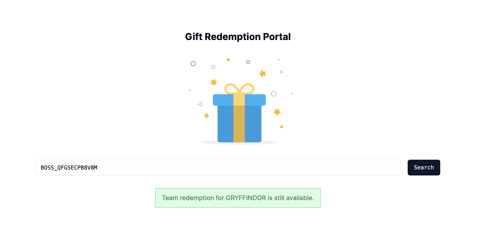

# Gift Redemption Portal 🎁

This is a [Next.js](https://nextjs.org/) project bootstrapped with [`create-next-app`](https://github.com/vercel/next.js/tree/canary/packages/create-next-app).



## Getting Started

First, install and run the development server:

```bash
npm install
npm run dev
```

Next, populate the database with the csv file given:

```bash
npm run seed
```

Open [http://localhost:3000](http://localhost:3000) with your browser to see the result.

This project uses [`next/font`](https://nextjs.org/docs/basic-features/font-optimization) to automatically optimize and load Inter, a custom Google Font.

## Frameworks and Testing
This project uses the following frameworks/libraries/tools:

- Framework: Next.js
- Language: Typescript
- Design: Tailwind CSS, Shadcn/UI, LottieFiles
- Database: Vercel Postgres
- Unit Testing: Jest

## Assumptions
The portal serves solely for viewing whether the team has redeemed their gift. Updating the redemption status will be initiated by clicking on the search bar again.


## Deployment 
The application has been hosted on Vercel, accessible [here](govtech-assessment-rxs6.vercel.app). However, due to existing bugs, it's recommended to view and debug the application locally on localhost instead.
